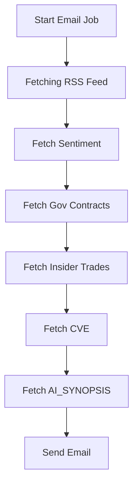

# Intelligence Newsletter Service
- This project aims to provide an automated email service deliver Yeetum Intelligence. We scrape open-source intelligence from a variety of vetted data sources and proceed to provide a brief summary along with those information with links.

## Workflow Diagram


## Create .env file
Modify the `.env.example` file with your parameters
```bash
LOGO_URL =
OPENAI_API_KEY = 
EMAIL = 
PASSWORD =
RECEIVER = 
SMTP_SERVER = 

SENTIMENT_URL =
INSIDER_URL = 
INSIDER_KEY = 
CONTRACT_URL = 
CONTRACT_KEY = 
YSI_FEED = https://si.yeetum.com/rss/
CVE_URL = 

PG_USER = 
PG_PASSWORD = 
DB_HOST= 
DB_NAME= 
DB_PORT= 
DB_STATEMENT = 
```

## Run
- The version of Python for testing was done in 3.9.13.
```
pip3 install -r requirements.txt
python3 g2.py
```

## Docker Build and Run
To run the Intelligence Newsletter Service using Docker, follow these steps:

1. Build the Docker image:
    ```bash
    docker build -t intelligence-newsletter-service .
    ```

2. Create a container from the image and run it:
    ```bash
    docker run -d --name yeetint-intelligence-newsletter
    intelligence-newsletter-service
    ```
    This will create a Docker container named `yeetint-intelligence-newsletter` and run the Intelligence Newsletter Service inside it.

3. To stop the container, use the following command:
    ```bash
    docker stop yeetint-intelligence-newsletter
    ```
    You can start the container again using the `docker start` command.

4. To remove the container, use the following command:
    ```bash
    docker rm yeetint-intelligence-newsletter
    ```
    This will remove the container, but the Docker image will still be available for future use.

Note: Make sure you have Docker installed and running on your machine before executing these commands.